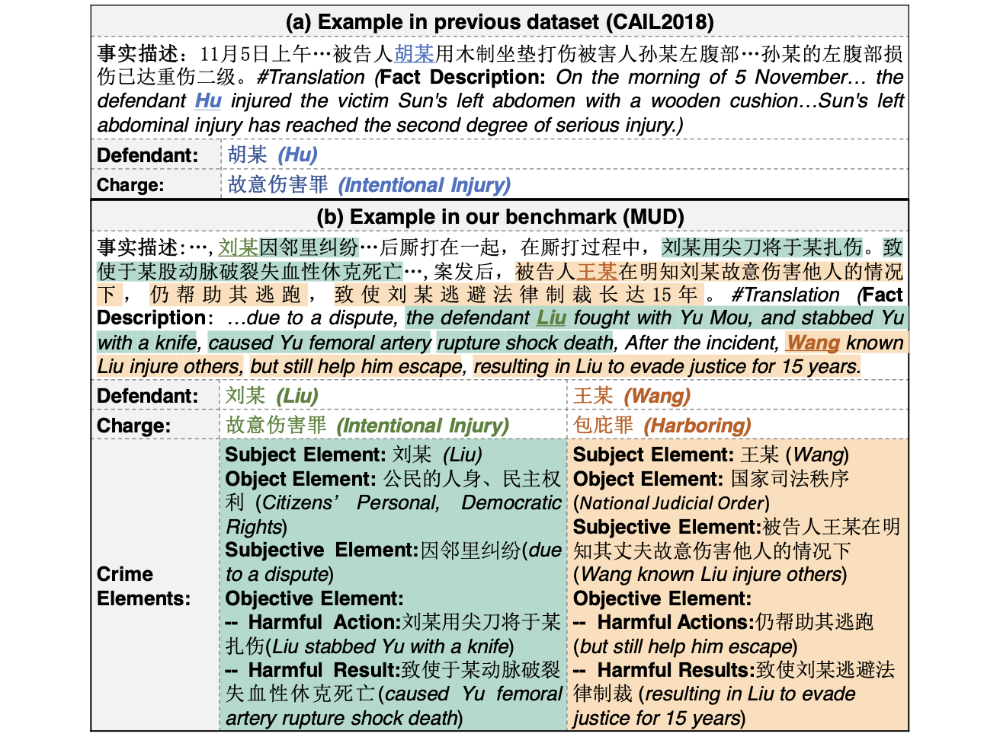
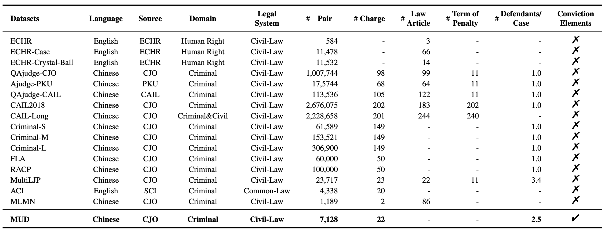
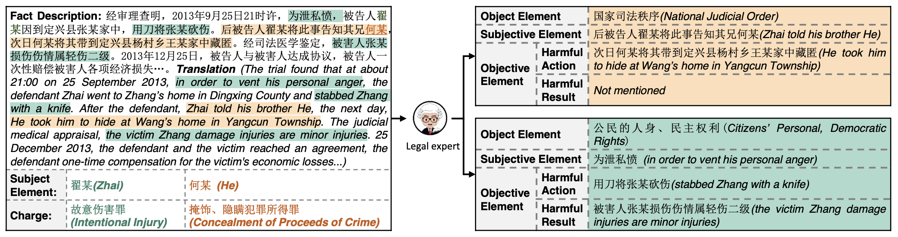
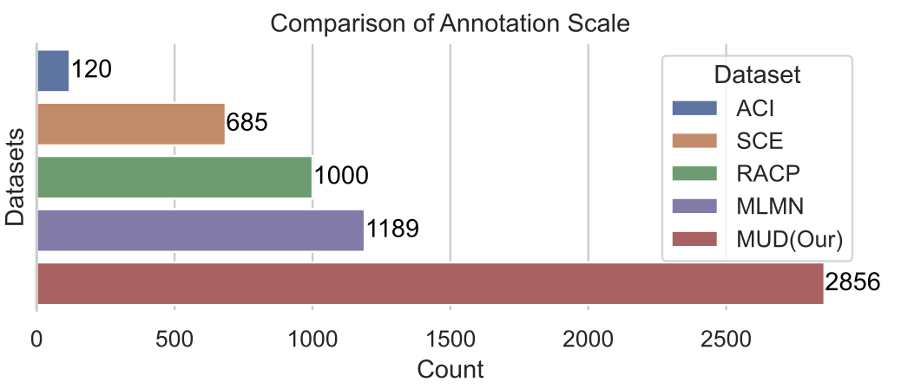
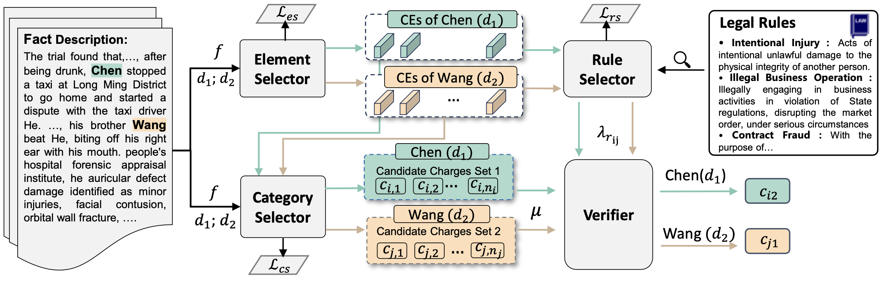
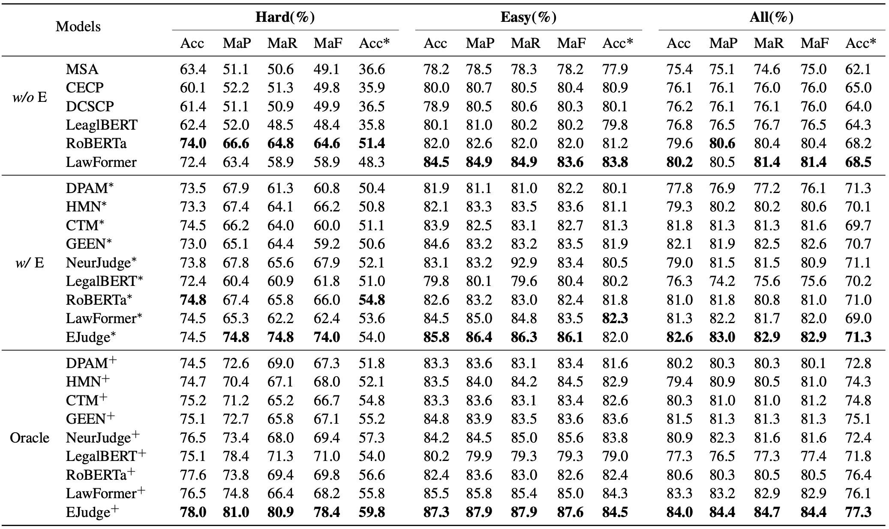
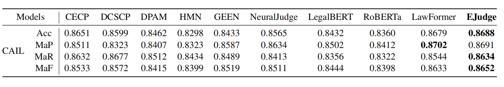

# Crime-Element-Informed Multi-Defendant Charge Prediction: Dataset and Modeling

## Overview
The charge prediction task aims to automatically recommend charges for each defendant given a fact description. We introduce a new dataset (named MELEE) containing multi-defendant legal cases with criminal elements annotations. Furthermore, based on MELEE, we propose a model named EJudge. It predicts charges by using extracted criminal elements while following legal rules, which provide a clear and justifiable rationale.

<!--  -->

## Dataset
Our dataset MELEE considers multi-defendant legal case and we annotate four types of criminal element for each defendant.

### Multiple Defendant
Our dataset MELEE comprises 2865 legal cases with an average of 2.5 defendants per case. Here is a comparison between the MELEE and other datasets. 

### Annotation Example
we ask three legal experts to annotate four types of criminal element for each defendant. Here is an annotation example.

### Annotation Scale

As far as we know, our dataset MELEE provides the largest fine-grained annotation scale for the charge prediction task.Here is a comparison between the MELEE and other datasets with fine-grained annotation. 

## Experiments

### Our Method
we propose a crime-element-informed charge prediction model named EJudge which consists of four components: the Element Selector, the Category Selector, the Rule Selector, and the Verifier.

### Baselines
We implement eleven competitive Baselines：[DPAM](https://www.yongfeng.me/attach/wang-sigir18.pdf),[MSA](https://link.springer.com/chapter/10.1007/978-981-15-1377-0_59),
[CECP](https://www.ijcai.org/proceedings/2022/0627.pdf),[DCSCP](https://link.springer.com/article/10.1007/s11280-021-00873-8),[HMN](https://dl.acm.org/doi/abs/10.1145/3331184.3331223),[NeurJudge](https://dl.acm.org/doi/abs/10.1145/3404835.3462826),[CTM]([./Baselines](https://aclanthology.org/2022.coling-1.235/)),[Chinese RoBERTa](https://ieeexplore.ieee.org/abstract/document/9599397),[LegalBERT](https://doi.org/10.18653/v1/2020.findings-emnlp.261),[LawFormer](https://aclanthology.org/2020.coling-main.88/)

### Training Configurations
Moreover, we provide three different training configurations: 

1) Without elements (*w/o* E). We develop models predicting the charge with only the given fact and the defendant's name. 

2) With extracted elements (*w/* E).} We develop models predicting the charge with extracted criminal elements. We mark models developed with this configuration with the symbol "*"

3) With annotated elements (Oracle). We develop models predicting the charge with annotated criminal elements. We mark models trained using this configuration with the symbol "+".
   

### Prefomance
 Baselines and our model EJudge their performances are as follows.

### Evaluation on CAIL2018
we further evalute our model EJudge on commonly used dataset [CAIL2018](https://arxiv.org/abs/1807.02478).

